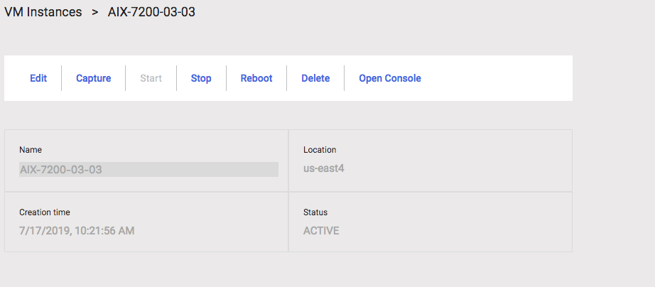

# Restoring an AIX mksysb image onto a Cloud VM

## Defining an AIX Helper VM
You can use an existing AIX virtual machine (VM) to copy an AIX mksysb archive. The `alt_disk_mksysb` command copies the mksysb archive onto a new volume. The `alt_disk_mksysb` command also gives you the option of rebooting from a specific disk image. The following screen capture shows a user-deployed AIX _helper VM_ named **AIX-7200-03-03**:



Before you copy an AIX mksysb archive, you must determine the amount of space the _helper VM_ needs to hold the mksysb image. In the following example, the mksysb image (`gdrh10v1.sysb`) is roughly 5.8 GB.


Next, you must identify a _helper VM_ file system with enough space to hold the mksysb image. If such a file system does not exist, you can attach a data volume as a _staging area_.

To display information about a volume group, use the `lsvg` command.


Running the `df -g` command displays information about the total space and available space on a file system.


In this instance, the `rootvg` volume group has enough space for creating a new file system, expanding an existing one, and storing the mksysb source image.

## Attaching a new (disk) volume
If your disk is not at the correct size, complete the following steps:

**Note:** You must also complete these steps if you want to store the mksysb image in a data disk for shared access or long-term storage.

1. Attach a new volume to **AIX-7200-03-03**.
2. Create a file system to hold the mksysb archive.
3. Select **Edit -> Disks -> Add new disk** to create and attach a new volume to **AIX-7200-03-03**.

    

4. Create a data volume and enter a specific size. In the following example, _mksysbfs_ is the volume name and has 20 GB of space for multiple mksysb archive files.

    

5. After successfully attaching the _mksysbfs_ volume to the _helper VM_, log in to the VM. The volume appears as a new hdisk.

6. Run the `cfgmgr` and `lspv` commands on the _helper VM_ to configure and show the new disk. The new disk is labeled as _hdisk1_ as shown in the following example.

    

    

7. Create an _AIX Volume Group_ by running the `mkvg` command. On the _helper VM_, `mksysbvg` is the volume group name.

    

8. Run the `crfs` command to create a file system and the `mount` command to mount it.

The following example shows a mounted file system (`/mksysb`) on the _VM helper_.


After you complete these steps, you must decide on the best Google access option. Google provides several different private access options. Each option allows VM instances with internal IP addresses to reach certain APIs and services.

Refer to the following link to choose an option that supports the APIs and services that you need to access:

```shell
Private Access Options for Services
https://cloud.google.com/vpc/docs/private-access-options
```
Log on to the source VM where the source mksysb resides and copy the image to the _helper VM_ after you choose an option. In the following example, the customer is using Secure Copy Protocol (scp) from an on-premises system and copying it into the `/mksysb` file system of the _helper VM_.

**Note**: If you did not decide on a private access option, or chose a different option for your internal IP access, your steps might vary.


## Creating the alternate disk image volume
Log on to the helper VM and verify that the image under `/mksysb` has an identical `cksum` as the reported size from the on-premises system (refer to the copy section). After verifying the matching sizes, you can create a volume large enough to hold the restored root volume group.

To determine the necessary volume size of the alternate disk, examine the contents of the `bosinst.data` file within the mksysb archive. The `bosinst.data` file in the archive contains stanza information that indicates the minimum space that is required to restore the mksysb. An easy way to accomplish this is to use the `restore` command to extract the `./images/bosinst.data` file from the mksysb archive.

Search the `bosinst.data` file and find the stanza that is named `target_disk_data`. This stanza indicates the minimum size in megabytes of the required volume in a `SIZE_MB = size` key value pair. The recorded size is used when creating the alternate disk image volume and attaching it to the helper VM.


To create and attach a new volume to **AIX-7200-03-03**, complete the following steps:

1. Select **Edit -> Disks -> Add new disk**.

    

2. Create a new data volume and enter the recorded size in gigabytes (it must be large enough to hold the restored root volume group) by selecting the correct options. In the following example, the name **AIX-7200-03-03-altdisk** is the volume name.

    

After successfully attaching the **AIX-7200-03-03-altdisk** volume to the helper VM, log on to the VM. Use the `cfgmgr` and `lspv` commands on the helper VM to show the new disk. In the following example, the new disk is named `hdisk2`.


## Restoring the alternate disk mksysb
You can now create an AIX boot disk from the source mksysb archive. To create an AIX boot disk from the source mksysb archive, run the `alt_disk_mksysb` command with the following options:

```shell
-m: Specify the mksysb archive that you transferred to the helper VM. In our example, the source mksysb archive is named `/mksysb/gdrh10v1.sysb`
-d: Specify the logical disk (hdisk) that is currently empty of a volume group label. In our example, the target disk is named `hdisk2`
-c: Use this option to set up a console device during VM deployment. Without a valid console, the VM does not boot if it needs to open the console for any reason.
```
After you run the `alt_disk_mksysb` command, the console displays information similar to the following:


Now, the target volume contains a valid root volume group (`rootvg`) that is boot-ready. Additionally, the bootlist is set. Before rebooting, perform the following checks:


When you are ready for the new environment to take effect, reboot the disk by using the `shutdown -Fr` command.

The device configuration can take several minutes. Upon its completion, the system's login prompt appears and the newly restored system is ready for login.


You have successfully restored the AIX mksysb archive and the environment is ready for your use.

## Detaching the staging volume (optional)
In the previous section, we used a separate image volume for storing the source mksysb. To detach, keep, or delete a volume, review the following information.

After the completion of the `alt_disk_mksysb` command, you can detach the staging volume (`mksysbvg`) from the _helper VM_. Before you detach the staging volume, you must close all available file systems by unmounting them. If no action is required, then it is safe to remove the volume group definition from the _helper VM_.

Use the `varyoffvg` and `exportvg` commands to remove the mksysbvg volume group as shown in the following example:


Upon the successful removal of the volume group definition, remove the disk definition by using the `rmdev` command.


You can now detach the image volume (disk) containing the source mksysb from the _helper VM_. To detach the disk from **AIX-7200-03-03**, select **Edit -> Disks -> Select** from the bucket icon next to `mksysbfs` volume.


After you successfully detach the disk from **AIX-7200-03-03**, you can attach the saved image volume to other VM instances.


