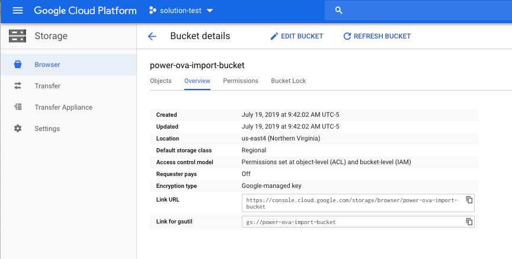
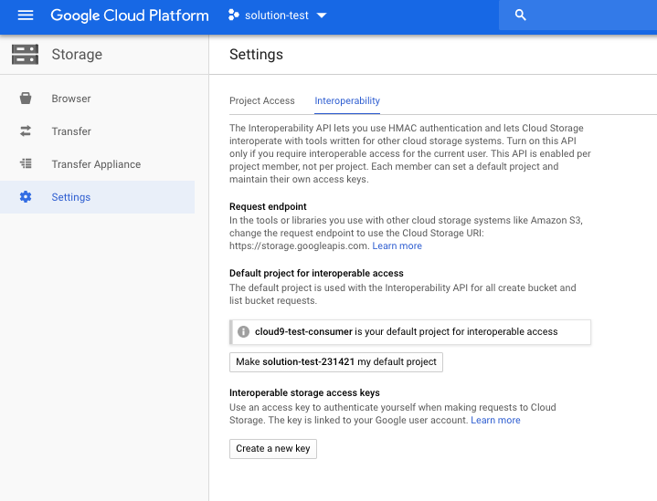
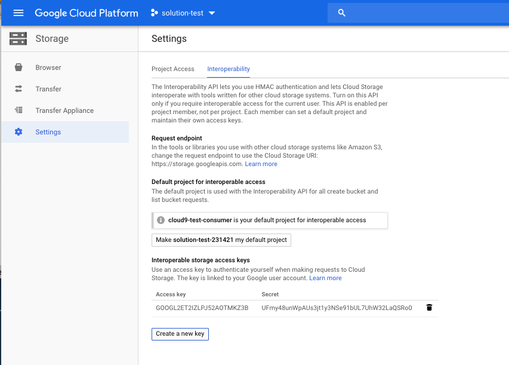
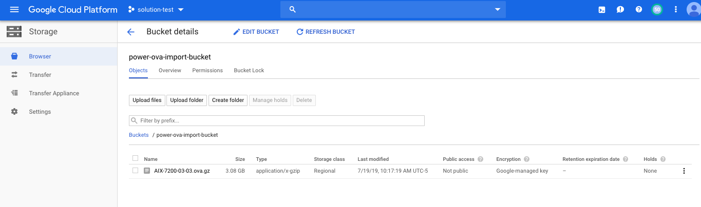
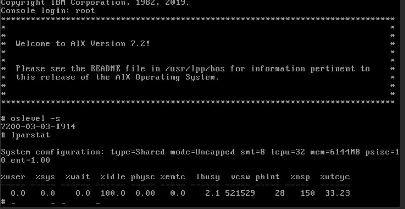

# How to import an OVA file into your Power cloud instance
You can import an OVA file to bring a new VM image and any attached data volumes into your Power cloud instance. An OVA file is an industry standard format that is used to package VM boot disk images and any related data volume images. If you are running an IBM Cloud PowerVC Manager 1.4.1, or later, landscape in your local environment, you can generate OVA files from your Power LPARs.

To bring an OVA file into your cloud instance image catalog and deploy it as a new VM, complete the following steps:

1. Start with a local OVA file (that your PowerVC managed landscape generated).
2. Upload the OVA file into a selected _Google Cloud Storage_ bucket.
3. Set up access keys to the _Google Cloud Storage_ bucket.

    **Note:** Issuing the operation that imports the OVA file into your cloud instance provides the access keys.

4. Import the OVA file by using either the web UI or running the `pcloud` command.
5. After the import operation is complete, you can deploy a VM by using the new image in your image catalog.

## Setting up a cloud storage bucket
You can set up a cloud storage bucket by using the `pcloud` command to import OVA files.

To begin, you must create a cloud storage bucket. The following graphic provides an overview of a user-created cloud storage bucket named `power-ova-import-bucket`. The _Link for gsutil_ field contains access information that is an important part of the import operation.



To enable access to the cloud storage bucket for the _Power Systems IaaS_ management service, you must create a storage access key. You can create a storage access key in the settings area of the cloud bucket management UI.



Selecting the `create a new key` option generates the access key and secret as shown in the following example:



After you generate an access key and secret, the cloud storage bucket can hold OVA files and be used with the Power IaaS management service image import feature. You can upload files to the cloud storage bucket by using the `upload files` feature of the web UI or with the `gsutil` command. For more information, visit the [Google Cloud Storage Documentation site](https://cloud.google.com/storage/docs/).

In the following example, a user created an OVA file that is named `AIX-7200-03-03.ova.gz` and placed it in the cloud storage bucket.



## Importing the OVA file into your cloud instance by using the pcloud command

The `pcloud compute images import` command imports an OVA file. For `pcloud compute images import` command usage and flag details, refer to the following code block:

```shell
pcloud compute images import -h
Import a new Image for a Cloud Instance.
Note that ImageID can be used as parameter instead of ImageName.

Usage:
  pcloud compute images import <ImageName> -p ImagePath -a AccessKey -s SecretKey [flags]

Flags:
  -a: --access string   Service Access Key
  -h: --help            Help for import
  -p: --path string     Path to Image starting with service endpoint and ending with image filename
  -s: --secret string   Service Secret Key

Global Flags:
  -F: --format string      Available formats: 'table', 'yaml', 'json', 'csv'
                           Default is command specific
                           Can be used with describe and list subcommands
  -D: --log.dir string     Override Log file directory
  -L: --log.name string    Override Log file name
  -V: --verbosity string   Overriddes default verbosity
```

* `ImageName` - the argument that assigns a name to the image after you import it into your image catalog.
* `ImagePath` - the argument that provides the _gsutil_ link to the cloud storage bucket, including the OVA file name.
* `AccessKey` - the generated storage access key. See the cloud bucket management UI settings.
* `SecretKey` - the generated secret key. See the cloud bucket management UI settings.

The following example shows a customer importaning an OVA file by using the `pcloud` command:

```shell
pcloud compute images import aix72-ova-import -p gs://power-ova-import-bucket/AIX-7200-03-03.ova.gz -a GOOGL2ET2IZLPJ52AOTMKZ3B -s UFmy48unWpAUs3jt1y3NSe91bUL7UhW32LaQSRo0
Image imported with ID: d090596b-3f55-4034-90d4-e519ff9e737e (complete Image importation is not immediate)
```

  **Note:** The `pcloud` command returns immediately. However, the actual time for the import operation to complete depends on the OVA file size.

  The `pcloud compute images describe` command monitors the progress of the import operation. While the import operation is in progress, the image state is **queued** as in the following example:

```shell
pcloud compute images describe aix72-ova-import
imageID: d090596b-3f55-4034-90d4-e519ff9e737e
name: aix72-ova-import
cloudID: ""
description: ""
size: 0
operatingSystem: aix
architecture: ppc64
state: queued
containerFormat: bare
diskFormat: raw
endianess: ""
creationDate: "2019-07-19T15:35:39.000Z"
updateDate: "2019-07-19T15:35:39.000Z"
```

After the import operation finishes, the image state transitions to **active**.

```shell
pcloud compute images describe aix72-ova-import
imageID: d090596b-3f55-4034-90d4-e519ff9e737e
name: aix72-ova-import
cloudID: ""
description: ""
size: 20
operatingSystem: aix
architecture: ppc64
state: active
containerFormat: bare
diskFormat: raw
endianess: big-endian
creationDate: "2019-07-19T15:35:39.000Z"
updateDate: "2019-07-19T15:40:50.000Z"
```

The image is now part of the image catalog for the cloud instance and can be used to create new VMs. You can also delete the OVA file from the cloud storage bucket and remove the access keys.

```shell
$ pcloud compute images list
ImageID                               Name
8f718bb5-495c-4a0d-b537-d2ad4b03f8c1  AIX-7200-03-03
d090596b-3f55-4034-90d4-e519ff9e737e  aix72-ova-import
```

## Creating a new VM with the imported image
You can create a VM with the newly imported image by typing in the following command:

```shell
$ pcloud compute instances create import-test-vm -t shared -p 1 -m 6 -n gcp-network -i aix72-ova-import
"import-test-vm" VM Instance being created (complete VM Instance creation is not immediate)
```

After a short period, the VM is deployed and is ready for access.

```shell
pcloud compute instances describe import-test-vm
instanceID: 8ac6c2eb-8497-444e-9aac-5b9b31a97aed
name: import-test-vm
cloudID: 7f16fae4f3f54d8bb62f75645db56905
processors: 1
procType: shared
memory: 6
migratable: false
status: ACTIVE
health: OK
systemType: IBM S922
imageID: d090596b-3f55-4034-90d4-e519ff9e737e
networks:
- ipAddress: 192.168.0.10
  macAddress: fa:86:bc:91:9d:20
  networkName: gcp-network
  networkID: 8e72b5cc-9e50-4b06-bc56-eb4e1781eefe
volumeIDs:
- 122405f4-14a9-49f0-a665-2b3c08f4a3f4
creationDate: "2019-07-19T16:20:49.000Z"
updateDate: "2019-07-19T16:20:49.000Z"
```
```shell
pcloud compute instances console import-test-vm
console: https://pforg.ibm.com/console/index.html?token=a3aa8793-ab07-4d2e-b51f-05a9bf44366f
```

To verify that the VM is working correctly, log into the system using the AIX console.


