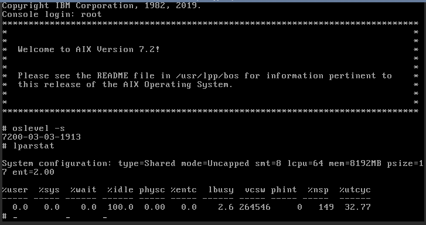

# An Introduction to the pcloud Command and Some Common Tasks
The pcloud command line tool allows you to create and manage the lifecycle of VMs on your IBM Power Systems for Google Cloud instance. You can use the pcloud command line tool to manage related resources such as VM images and data volumes. The pcloud command line tool is a stand alone executable file that is available for use on Mac, Windows, and Linux operating systems. You can obtain the latest pcloud binaries from the [cli download site](https://pforg.ibm.com/downloads/cli/).

## Setting up pcloud
Before you can start using the pcloud tool, you must have an available Power Cloud instance that is provisioned and attached to a selected GCP project within your organization. This process occurs when you subscribe to the offering in the GCP Marketplace. Next, run the `pcloud auth login` command to authenticate to your cloud instance. When you authenticate, you must use the registered Google identity that is associated with the organization and the billing account that is used in the subscription. Running the `pcloud auth login` command provides you with a unique code to register your pcloud instance. In the following example, XXXX-YYYY represents the unique code.

```shell
pcloud auth login
To authorize pcloud you will need to complete following steps (within 30 minutes):
  1. Navigate to: https://www.google.com/device
  2. Enter the code: XXXX-YYYY
  3. Select your Google ID that was registered with IBM Power Systems for Google Cloud


Once these steps have been completed the login command will complete within 5 seconds
```

When you go to [https://www.google.com/device](https://www.google.com/device), you must enter the code in the dialog box. Next, a popup is displayed and you select the appropriate identity. After you complete this process, pcloud is now enabled to operate against the Power Systems Cloud instance that is associated with your Google identity. To verify that pcloud is enabled, run the `pcloud config list`, `pcloud compute clouds list`, and `pcloud compute clouds describe` commands. The following example displays the correct sequence of running these commands.

```shell
pcloud config list
accountID: testuser
cloudID: 767738cf4a2248e09f16482a6b1de6ea


pcloud compute clouds list
CloudID                           Name    Region
767738cf4a2248e09f16482a6b1de6ea  cloud9  us-east4


pcloud compute clouds describe cloud9
cloudID: 767738cf4a2248e09f16482a6b1de6ea
name: cloud9
tenantID: testuser
region: us-east4
processors: 20
memory: 60
```

## pcloud documentation
You can use the --help option with all subcommands to get additional information and available options for each of the operations. You can run the `pcloud-doc` command to generate an up-to-date directory of documentation topics that are markdown (.md) files. To view the documentation in markdown, you can use a browser plug-in or other available tools. For example, you can use the [Markdown Viewer](https://chrome.google.com/webstore/detail/markdown-viewer/ckkdlimhmcjmikdlpkmbgfkaikojcbjk?hl=en) plug-in for the Chrome browser.

## Obtaining a VM image so you can create your first VM (LPAR)
Before you can create your first VM on your Power cloud instance, you must have a VM image in your cloud instance catalog. IBM provides a few *stock* images. These stock images are ideal for creating your first VM. The service also supports options to bring your own images.

To view available stock images, run the `pcloud compute images list -a` command. The following example displays the output from running this command:

```shell
pcloud compute images list -a
ImageID                               Name
9f72fc9b-a8b9-4d50-ad2d-65564a80b6d8  7100-05-04
0d50200b-c1b7-41fc-a858-7d3627714384  7200-03-03
```
The previous command without the `-a` flag can be used to list the images that are currently in your image catalog.

```shell
pcloud compute images list
ImageID                               Name
a232f02c-f041-480a-8b5a-87058710e2b3  7200-03-03
```

To copy a stock image into your cloud catalog, run the `pcloud compute images create` command. The following example uses the AIX 7100-05-04 stock image.

```shell
pcloud compute images create 9f72fc9b-a8b9-4d50-ad2d-65564a80b6d8
```

Now that you created the 7100-05-04 image, it is part of the cloud instance catalog and can be used to deploy VMs.

## Creating a VM and accessing it for the first time
After you have an image, you can create a VM by running the `pcloud compute instances create` command. The following is an example of the output from using the `-h` flag for this command:

```shell
pcloud compute instances create -h
Create a VM Instance in IBM Power Cloud


Usage:
  pcloud compute instances create <VMName> [flags]


Flags:
  -h, --help                            help for create
  -i, --image string                    Image ID to allocate to the VM Instance
  -k, --keypair string                  SSHKeyPair Name
  -m, --memory float                    Memory size (in GB) to allocate to the VM Instance (default 4)
  -n, --network strings                 Network ID to assign to the VM Instance (several --network allowed)
  -p, --processors float                Number of processors to allocate to the VM Instance (default 2)
  -t, --proctype string                 Shared or Dedicated Processing Pool: "shared" "dedicated" (default "dedicated")
  -r, --replicants float                Number of replicants (default 1)
  -s, --replicantsNamingScheme string   Replicants naming scheme: "prefix" "suffix" (default "suffix")
  -v, --volume strings                  Volume ID to assign to the VM Instance (several --volume allowed)


Global Flags:
  -F, --format string      Available formats: 'table', 'yaml', 'json', 'csv'
                           Default is command specific
                           Can be used with describe/list/create subcommands
  -D, --log.dir string     Override Log file directory
  -L, --log.name string    Override Log file name
  -V, --verbosity string   Overriddes default verbosity
```

Some of the flags have default values, but you must enter several parameters. For example, you must enter the VM image name and the network ID.

You can list the available networks by running the `pcloud compute networks list` command. A cloud instance has at least one network that was created when it was initially provisioned. This network is what connects the cloud instance and its VMs to GCP.

If you run the command in the following example, you create a new AIX 7.2 VM with two entitled shared cores of compute and 8 GB of RAM.

```shell
pcloud compute instances create mytestvm -i 7200-03-03 -m 8 -p 2 -t shared -n gcpnetwork
```

Creating a new VM instance can take a few minutes to fully complete. You can look at the state of the VM by using the `describe` subcommand. In the following example, the VM is still booting up and initializing.

```shell
pcloud compute instances describe mytestvm
instanceID: c95bdb20-668a-4089-aaa5-7b69ec4f942b
name: mytestvm
cloudID: 767738cf4a2248e09f16482a6b1de6ea
processors: 2
procType: shared
memory: 8
status: ACTIVE
health: WARNING
systemType: IBM S922
imageID: a232f02c-f041-480a-8b5a-87058710e2b3
networks:
- ipAddress: 172.16.7.5
  macAddress: fa:c8:fa:93:ab:20
  networkName: gcpnetwork
  networkID: afa8b7f7-1fa3-4792-80e4-420bccaa5a1c
volumeIDs:
- f71f34d1-72f9-475b-b5ec-a8638b30c100
creationDate: "2019-06-03T16:59:43.000Z"
updateDate: "2019-06-03T16:59:43.000Z"
```

To initially access the new VM, you can use the `console` subcommand. This subcommand generates a url that can be used in your web browser to access the console of the VM. A recommended first task is to create a password for root using the `passwd` command so that ssh as root can be used with the VM.

```shell
pcloud compute instances console mytestvm


console: https://pforg.ibm.com/console/index.html?token=30ffd05a-c263-42b8-bc64-b33767b70f6f
```



## Working with additional data volumes

You can create more data volumes to hold application data or support multi-disk use cases with your VMs by using the `compute volumes` subcommand. The following are examples of using the `compute volumes` subcommand

To list out existing volumes:

```shell
pcloud compute volumes list
VolumeID                              Name
f71f34d1-72f9-475b-b5ec-a8638b30c100  mytestvm-c95bdb20-000002b4-boot-0
84d1f977-a121-4f17-8256-c7a901549ba9  KylejTest-fc838637-00000229-boot-0
```

To create a new 10 GB SSD volume and display it in the list of volumes:

```shell
pcloud compute volumes create my-test-volume -s 10 -t ssd
Volume "my-test-volume" created with ID: 4cd31e0e-eea1-4d3d-8b15-90a272b27bc0


pcloud compute volumes list
VolumeID                              Name
4cd31e0e-eea1-4d3d-8b15-90a272b27bc0  my-test-volume
f71f34d1-72f9-475b-b5ec-a8638b30c100  mytestvm-c95bdb20-000002b4-boot-0
84d1f977-a121-4f17-8256-c7a901549ba9  KylejTest-fc838637-00000229-boot-0
```

To show the details of a volume:

```shell
pcloud compute volumes describe my-test-volume
volumeID: 4cd31e0e-eea1-4d3d-8b15-90a272b27bc0
name: my-test-volume
cloudID: 767738cf4a2248e09f16482a6b1de6ea
diskType: ssd
size: 10
shareable: false
state: available
creationDate: "2019-06-03T17:57:28.000Z"
updateDate: "2019-06-03T17:57:29.000Z"
```

The following example shows how to attach the new volume to an existing VM. In the following example, the new `4cd31e0e-eea1-4d3d-8b15-90a272b27bc0` is now attached the VM.

```shell
pcloud compute volumes attach my-test-volume -i mytestvm
Attaching "my-test-volume" Volume to "mytestvm" VM Instance …


pcloud compute instances describe mytestvm
instanceID: c95bdb20-668a-4089-aaa5-7b69ec4f942b
name: mytestvm
cloudID: 767738cf4a2248e09f16482a6b1de6ea
processors: 2
procType: shared
memory: 8
status: ACTIVE
health: OK
systemType: IBM S922
imageID: a232f02c-f041-480a-8b5a-87058710e2b3
networks:
- ipAddress: 172.16.7.5
  macAddress: fa:c8:fa:93:ab:20
  networkName: gcpnetwork
  networkID: afa8b7f7-1fa3-4792-80e4-420bccaa5a1c
volumeIDs:
- 4cd31e0e-eea1-4d3d-8b15-90a272b27bc0
- f71f34d1-72f9-475b-b5ec-a8638b30c100
creationDate: "2019-06-03T16:59:43.000Z"
updateDate: "2019-06-03T16:59:43.000Z"
```
